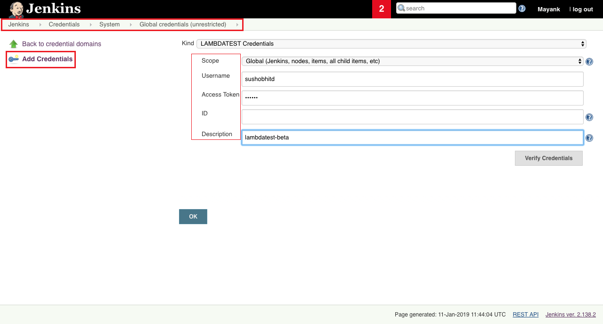
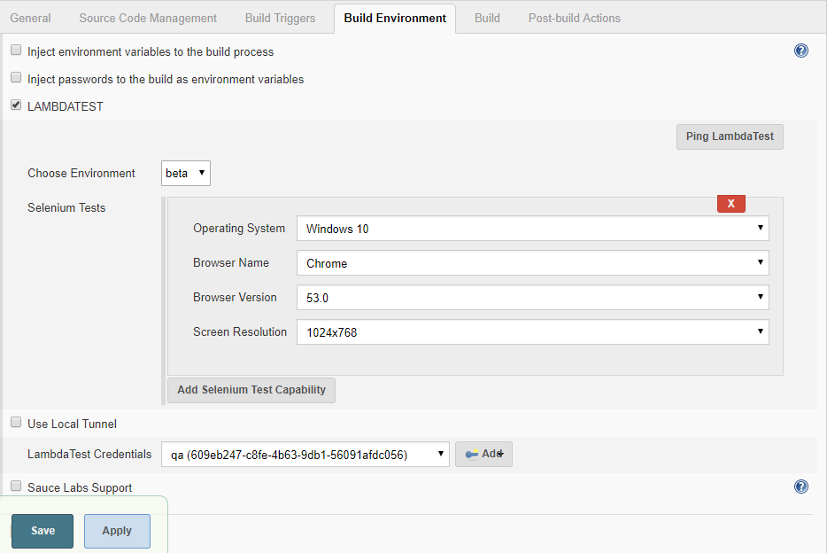
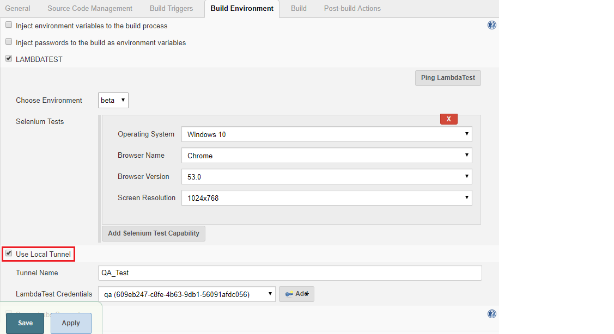
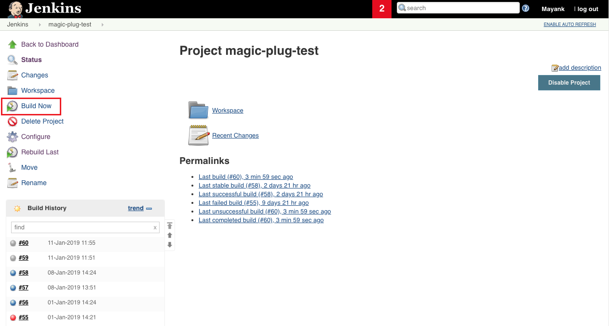
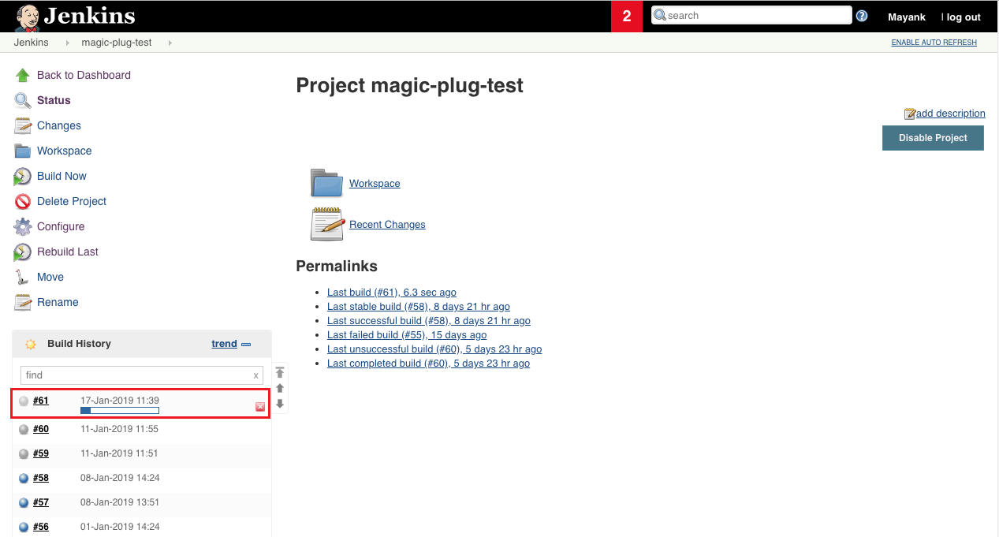
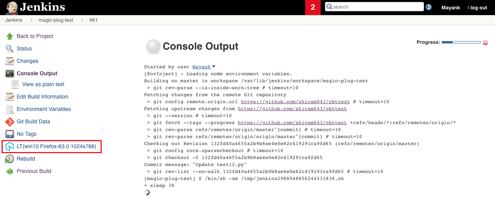
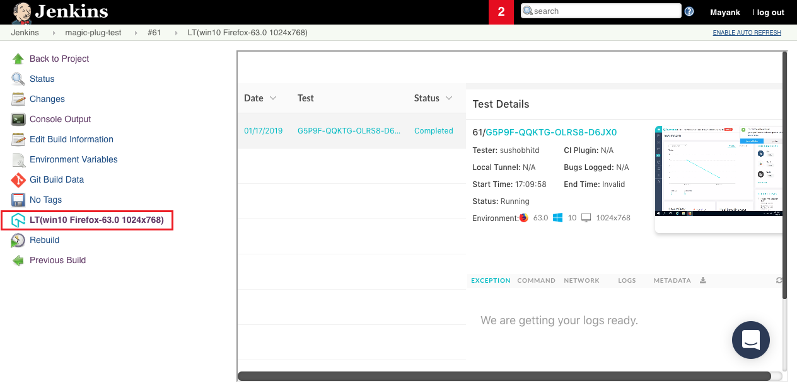

 *LambdaTest Plugin*

[With LambdaTest Jenkins plugin you will be able to easily automate your
Selenium test scripts by connecting your Jenkins CI instance to
LambdaTest Selenium Grid. LambdaTest Selenium Grid will offer you a wide
library of 2000+ browsers and browser versions so you could achieve a
higher test coverage while performing automation testing using the
Selenium test suite.]{style="color: rgb(74,74,74);"}

+-----------------------------------------------------------------------+
|     {jenkins-plugin-info:lambdatest-automation}                       |
+-----------------------------------------------------------------------+

  ---------------------------------------------------------------------------------------
  This plugin allows you to integrate with LambdaTest.
  ---------------------------------------------------------------------------------------

**LambdaTest Overview**
-----------------------

[LambdaTest is one of the fastest growing cross browser testing platform
that offers both manual and automation cross browser testing features.
Used by more than 60,000 organizations across the globe,
]{style="color: rgb(0,0,0);"}[LambdaTest can help you test your website
or web apps on over 2000+ different browser environment combinations.
All running real browsers and browser versions. LambdaTest online
selenium grid cloud helps automation testing teams in running their test
scripts across all these environments. In addition, the LambdaTest
selenium grid offers integrations with numerous CI/CD tools which in
turn help users in fully automating their continuous testing workflow.
LambdaTest gives you instant access to browsers + OS combination
environment of your choice freeing the users from the hassle of setting
up browser compatibility testing environments and testing
infrastructure. ]{style="color: rgb(0,0,0);"}[To start using
LambdaTest, ]{style="color: rgb(0,0,0);"}[[signup for a
freemium](https://accounts.lambdatest.com/register)]{style="color: rgb(51,102,255);"}[ account
now and get a lifetime free access of their testing
platform. ]{style="color: rgb(0,0,0);"}

[LambdaTest has been the first choice for hundreds of global companies,
including industry leaders such as Amazon, Walmart, Edureka, eBay,
Accenture, Livspace, Brother industries and more. Learn
more at ]{style="color: rgb(0,0,0);"}[[www.lambdatest.com]{style="color: rgb(17,85,204);"}](https://www.lambdatest.com/)[. ]{style="color: rgb(0,0,0);"}

**[Features]{style="color: rgb(210,73,57);"}**
----------------------------------------------

1.  Manage your LambdaTest credentials globally or per build job.
2.  Set up and tear down [Lambda
    Tunnel](https://www.lambdatest.com/support/docs/testing-locally-hosted-pages/)
    for testing internal, dev or staging environments.
3.  Running your first Jenkins Test with LambdaTest Jenkins Plugin.

**Prerequisites**
-----------------

1.  Minimum Jenkins version supported is 1.653+.
2.  If you are using Java, we support all versions of Java up to Java 9.

**Installing The Jenkins Plugin**
---------------------------------

[Once you download L]{style="color: rgb(74,74,74);"}[ambdaTest Jenkins
plugin to run your Selenium tests you need to grant the **administrator
level access** before proceeding with Jenkins
installation.]{style="color: rgb(74,74,74);"}

  ---------------------------------------------------------------------------------------------------------------------------------------------------------------------
  [Make sure to have no active build jobs in execution or queue before proceeding with the installation of LambdaTest Jenkins Plugin.]{style="color: rgb(74,74,74);"}
  ---------------------------------------------------------------------------------------------------------------------------------------------------------------------

1.  Click **Manage Jenkins** then **Manage Plugins**.
2.  Click the **Available** tab.
3.  In the **Filter** box type **LambdaTest**. You will encounter a list
    of plugins where you need to select **LambdaTest**.
4.  To install LambdaTest Jenkins Plugin, you would have to select the
    checkbox in front of LambdaTest. After the installation of plugin
    completes successfully, you will be able to find the LambdaTest
    Jenkins plugin under your installed plugins.

  --------------------------------------------------------------------------------------------------------------------------------------------------------------------------------------------------------------------------------------------------------------------------------------------------------------------------------------------------------------------------------------------------------
  [Sometimes your recently installed plugins fail to synchronize with your available plugins on Jenkins. In case if you don't find LambdaTest plugin under your available plugins, then you could force Jenkins to refresh the list by simply clicking the ]{style="color: rgb(74,74,74);"}**Check Now**[ button to fetch latest plugins from the Jenkins update centre.]{style="color: rgb(74,74,74);"}
  --------------------------------------------------------------------------------------------------------------------------------------------------------------------------------------------------------------------------------------------------------------------------------------------------------------------------------------------------------------------------------------------------------

**Configure LambdaTest Credentials Using Jenkins UI** {#configure-lambdatest-credentials-using-jenkins-ui style="text-align: left;"}
-----------------------------------------------------

1.  On the Home page of Jenkins click **Credentials**.
2.  Under **Credentials** click **System**. System page displays.
3.  In the System, click **Global credentials** (Unrestricted)
    domain. **Global credentials** page opens.
4.  Click **Add Credentials**. Add Credentials page opens.
5.  Enter the relevant data in the fields and click **Verify
    Credentials**. After verification click the **OK** button.\
    Jenkins generate the ID which is visible in the **Credential** page.
    Save your
    changes.{.confluence-embedded-image
    .confluence-external-resource}
6.  [After your credentials are successfully added then an ID would be
    generated by Jenkins. To retrieve this ID for LambdaTest Credentials
    you would have to go to Jenkins home page and click
    on ]{style="color: rgb(74,74,74);"}**Credentials**[ from the left
    navigation menu.]{style="color: rgb(74,74,74);"}
7.  [From the Jenkins home page,
    click ]{style="color: rgb(74,74,74);"}**Credentials**[ from the left
    menu. You can copy the ID for LambdaTest
    credentials.]{style="color: rgb(74,74,74);"}

**Configuring The Build Environment Through Jenkins UI** {#configuring-the-build-environment-through-jenkins-ui style="text-align: left;"}
--------------------------------------------------------

1.  [Visit the tab for ]{style="color: rgb(74,74,74);"}**Build
    Environment**[ and mark the tick on the box left
    to ]{style="color: rgb(74,74,74);"}**LAMBDATEST**[.\
    {.confluence-embedded-image
    .confluence-external-resource}]{style="color: rgb(74,74,74);"}

**Configure LambdaTest Tunnel For Local Testing** {#configure-lambdatest-tunnel-for-local-testing style="text-align: left;"}
-------------------------------------------------

**Lambda Tunnel **is a feature of LambdaTest that allows you to perform
cross browser testing on your locally hosted web pages and web apps.
Lambda Tunnel establishes an SSH tunnel between your local machine and
LambdaTest cloud servers to provide you with a testing environment to
ensure cross browser compatibility of a web application before making it
live on the Production environment. [The plugin is responsible for
downloading the binary for the platform that the build job is running on
and starting and tearing down the secure
tunnel.]{style="color: rgb(23,43,77);"}

Under your Build Environment details, you will find a checkbox to **Use
Local Tunnel**. Provide LambdaTest Credentials under it and hit
the **Add **button before saving the Build Environment details.

{.confluence-embedded-image}

  ----------------------------------------------------------------------------------------------------------------------------------------------------------------------------------------------------------------------------------------------------------------------------------------------------------------------------------------------------------------------------------------------------------------------------------------------------------------------------------------------------------------------------
  We would recommend keeping the LambdaTest Local Path empty, that way, the plugin will download the LT binary file automatically. However, if you wish to use a binary by downloading externally then you need to provide the location of the file as the LambdaTest Local Path. But if your Jenkins works on the master-slave configuration set up, then it would be best to leave the path empty for allowing the plugin to download the relevant binary file with respect to the operating system of your local machine.
  ----------------------------------------------------------------------------------------------------------------------------------------------------------------------------------------------------------------------------------------------------------------------------------------------------------------------------------------------------------------------------------------------------------------------------------------------------------------------------------------------------------------------------

\

**Running Your First Test** {#running-your-first-test style="text-align: left;"}
---------------------------

1.  [ To run your first test using Jenkins LambdaTest plugin, you would
    need to set a test build. You can perform that easily through
    Jenkins UI by clicking on ]{style="color: rgb(74,74,74);"}**Build
    Now**[.\
    {.confluence-embedded-image
    .confluence-external-resource}\
    \
    \
    ]{style="color: rgb(74,74,74);"}
2.  [ As you click on **Build Now**, you will find a new build
    generating under the build history.\
    {.confluence-embedded-image
    .confluence-external-resource}\
    \
    \
    ]{style="color: rgb(74,74,74);"}
3.  [ If you click on the build you will find the logs for console
    output. You would also notice a LambdaTest icon on the left which
    will provide you in-depth details regarding your Selenium test
    through an i-frame.]{style="color: rgb(74,74,74);"}[\
    {.confluence-embedded-image
    .confluence-external-resource}\
    \
    ]{style="color: rgb(74,74,74);"}[\
    ]{style="color: rgb(74,74,74);"}
4.  [As you click on the LT icon, your details for the Selenium test
    will be loaded with respect to LambdaTest platform usage. This will
    include details of the test session, including the video log as
    well.\
    {.confluence-embedded-image
    .confluence-external-resource}\
    ]{style="color: rgb(74,74,74);"}

\

\

 
